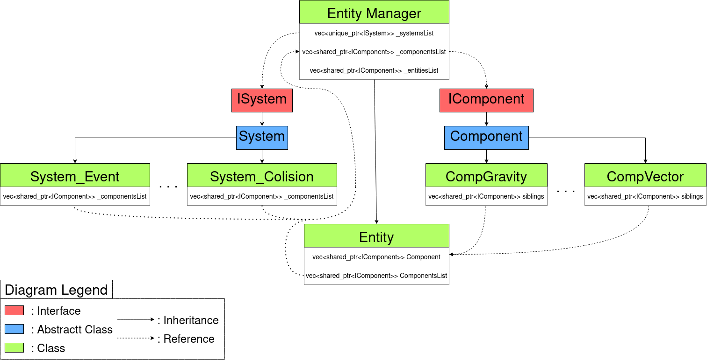
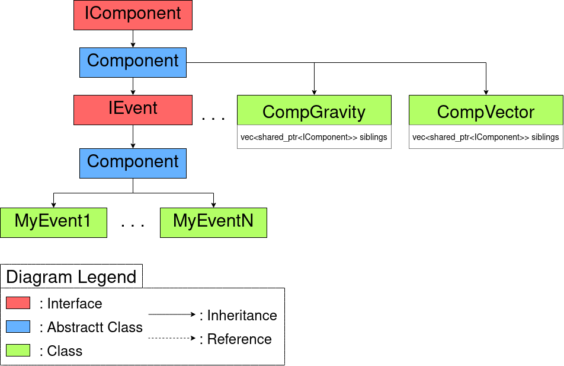

# ECS

The Entity Component System makes it easier to create and compute a game. Current available components and systems :
<ul>
    <li>Position (Manage an entity's position)</li>
    <li>Sprite (Allow to draw, set textures)</li>
    <li>Animation (SpriteSheet animation)</li>
    <li>Colision (allow entity to collide with another)</li>
    <li>Gravity (Apply gravity)</li>
    <li>Move (Allow entity to move on player inputs)</li>
    <li>Shoot (Allo entity to shoot on player input)</li>
    <li>Vector (Give direction)</li>
    <li>Velocity (Give speed)</li>
</ul>
To use the ECS you first need to declare <b>Manager</b> which will handle all entities.<br>
You can then add entities using <b>manager.AddEntity()</b> and you attach components to these entities using <b>entity.addComponent<ComponentYouWantToAdd>()</b>.
<ul>
    <li>To create new components you need the new component to inherit from Component.</li>
    <li>To create new systems you need the new system to inherit from System.</li>
</ul>

# ECS Diagram



<br /><br />

# Add your own Event

You can custom your own event with inheritance of EventComponent



<br />

Example:
```
#pragma once
#include "EntityManager.hpp"

class MyEvent : public EventComponent {
    public:
        MyEvent(std::vector<std::shared_ptr<IComponent>>& sibling) : _siblings(sibling) {}
        std::vector<std::shared_ptr<IComponent>>& getSiblings() {
            return _siblings;
        }
        void onDeath(EntityManager& admin);
        void onRightScreen(EntityManager& admin);
        void onLeftScreen(EntityManager& admin);

    private:
        std::vector<std::shared_ptr<IComponent>>& _siblings;
};
```
You now have acces at ```onDeath()``` ```onRightScreen()```  ```onLeftScreen()``` 

<br /><br />

# Components

AnimComponent - Handles Animations

    AnimComponent(std::vector<std::shared_ptr<IComponent>>& sibling, EntityManager& admin)
    void setAnime(bool isAnimated)
    bool getAnime()
    void setIdlAnim(sf::IntRect rect, int nbFrame, float frequency, bool isLoop)
    void setKeysAnim(sf::Keyboard::Key key, sf::IntRect rect, int nbFrame, float frequency, bool isOnce, bool isMaintain)
    void setCurrAnim(AnimInfos curr)
    void setCurrAnim()
    std::vector<sf::Keyboard::Key> getKeysAnim()
    void wantKeysAnim(sf::Keyboard::Key key, bool wantToAnim)
    std::map<sf::Keyboard::Key, AnimInfos> getKeysInfos()
    AnimInfos& getCurrAnimInfos()

ColisionComponent - Handles Collisions

    ColisionComponent(std::vector<std::shared_ptr<IComponent>>& sibling, EntityManager& admin)
    ColisionComponent(std::vector<std::shared_ptr<IComponent>>& sibling, EntityManager& admin, EntityType type)
    
    void setEntityType(EntityType type)
    EntityType getEntityType()
    
EventComponent - Handles Events

    std::string getNameComp()
    std::vector<std::shared_ptr<IComponent>>& getSiblings()
    void onDeath()
    void onRightScreen()
    void onLeftScreen()
    void onColision(ComponentR, ComponentR, EntityType)
    void setPlayerId(int
    int getPlayerId()
    
GravityComponent - Adds gravity to an Entity

    GravityComponent(std::vector<std::shared_ptr<IComponent>>& sibling, EntityManager& admin)
    
    float getG()
    std::string getNameComp()
    void setMovX(float movX)
    void setMovY(float movY)
    
MoveComponent - Handles movement for an Entity 

    MoveComponent(std::vector<std::shared_ptr<IComponent>>& sibling, EntityManager& admin)
    
    void setMovX(float movX)
    void setMovY(float movY)
    float getMovX()
    float getMovY()
    
PositionComponent - Needed for an Entity to have a position

    PositionComponent(std::vector<std::shared_ptr<IComponent>>& sibling, EntityManager& admin)
    PositionComponent(std::vector<std::shared_ptr<IComponent>>& sibling, EntityManager& admin, float x, float y)
    float getX()
    float getY()
    void setPos(float x, float y)
    std::string getNameComp()
    
SceneComponent - Handles scenes
    
    SceneComponent(std::vector<std::shared_ptr<IComponent>>& sibling, EntityManager& admin)
    SceneComponent(std::vector<std::shared_ptr<IComponent>>& sibling, EntityManager& admin, int idScene)
    void setIdScene(int idScene)
    int getIdScene()
    std::string getNameComp()
    
ShootComponent - Allows an Entity to generate Entities

    ShootComponent(std::vector<std::shared_ptr<IComponent>>& sibling, EntityManager& admin, std::string path)
    
    std::string getPath()
    sf::Time getTimeBeforeLastShoot()
    float getShootPerSecond()
    float getSize()
    bool getWantToShoot()
    void setSize(float size)
    void setShootPerSecond(float shootPerSec)
    void setShootTime()
    void setWantToShoot(bool state)
    void resetShootTime()
    
SoundComponent - Handles sounds

    SoundComponent(std::vector<std::shared_ptr<IComponent>>& sibling, EntityManager& admin)
    
    std::string getNameComp()
    std::vector<std::shared_ptr<IComponent>>& getSiblings()
    void setSoundKey(sf::Keyboard::Key key, std::string path)
    void setSoundDeath(std::string path)
    void setSoundDeath(std::string path)
    void playSoundKeyboard(sf::Keyboard::Key key)
    void playSoundDeath()
    void playSoundShoot()
    void setSoundShoot(std::string path)
    void setPathPlaying(std::string path)
    std::string getPathPlaying()
    
TextureSpriteComp

    TextureSpriteComp(std::vector<std::shared_ptr<IComponent>>& sibling, EntityManager& admin, std::string path)
    
    void setTextureRect(sf::IntRect newIntRect)
    void setScale(float scX, float scY)
    sf::Vector2f getRealSize()
    sf::Vector2f getScale()
    sf::IntRect getTextRect()
    std::string getPath()
    sf::Sprite& getSprite()
    std::string getNameComp()
    std::vector<std::shared_ptr<IComponent>>& getSiblings()

VectorComponent - Handles vectors

    VectorComponent(std::vector<std::shared_ptr<IComponent>>& sibling, EntityManager& admin)
    VectorComponent(std::vector<std::shared_ptr<IComponent>>& sibling, EntityManager& admin, float vecX, float vecY)
    
    float getVectorX()
    float getVectorY()
    void setVectorX(float x)
    void setVectorY(float y)
    std::string getNameComp()
    
VelocityComponent - Handles velocities

    VelocityComponent(std::vector<std::shared_ptr<IComponent>>& sibling, EntityManager& admin)
    VelocityComponent(std::vector<std::shared_ptr<IComponent>>& sibling, EntityManager& admin, float velX, float velY)
    
    float getVelocityX()
    float getVelocityY()
    void setVelocityX(float x)
    void setVelocityY(float y)
    std::string getNameComp()
    

# Examples

Simple example of a single sprite moovable by the player

```
int main()
{
    EntityManager admin;

    EntityR ship = admin.addEntity();
    ComponentR textShip = ship->addComponent<TextureSpriteComp>("./sprites/ship_34_15.png");
    ship->addComponent<PositionComponent>(100, 200);
    ship->addComponent<MoveComponent>();
    ship->addComponent<VelocityComponent>(10, 7);

    textShip->setFrameSize(33, 15);
    textShip->setFrame(2);
    textShip->setScale(2, 2);

    while (admin.isOpen()) {
        admin.update();
    }
    return 0;
}
```
