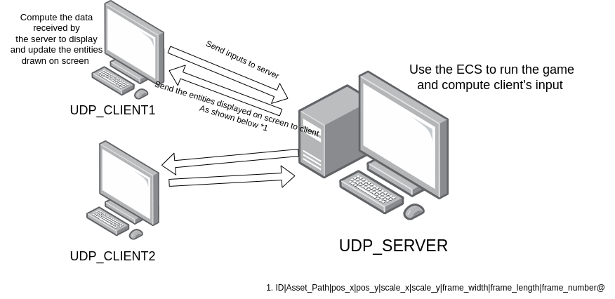

# NETWORKING

The base of networking is to allow players to play on the same party. We can achieve this with the help of ASIO :
<ul>
    <li>cross-platform C++ library</li>
    <li>Low-level I/O programing</li>
    <li>Asynchronous model using modern C++</li>
</ul>
With this methode we can build a server using IPC (Inter Process Communication) with a UDP/IP network.

The goal of our networking is give players the possibility to host their parties and play together.

#### SERVER USAGE

You must disable the firewall on the machine running the server in order to enable the communinications between multiple computers on the same network using IPv4.  

    On Fedora : 

> sudo systemctl stop firewalld

    On Ubuntu :

> sudo ufw disable

You can start the server on any unused port using the command :

> sudo ./bin/r-type_server <port<port>>

-----------------------------------------------------------------------------------

#### CLIENT USAGE

If you want to play with an other computer on the same Network, you want to know the IPv4 of the machine running the server, you can get it by running the following command on the server's machine :

> ip -4 addr

You're looking for an IP starting by : 192.168.

Now in order to start the client you'll have to run the command :

> ./bin/r-type_client <IPv4<Ip>> <port_used_by_server<port>>

-----------------------------------------------------------------

## NETWORK PROTOCOL

